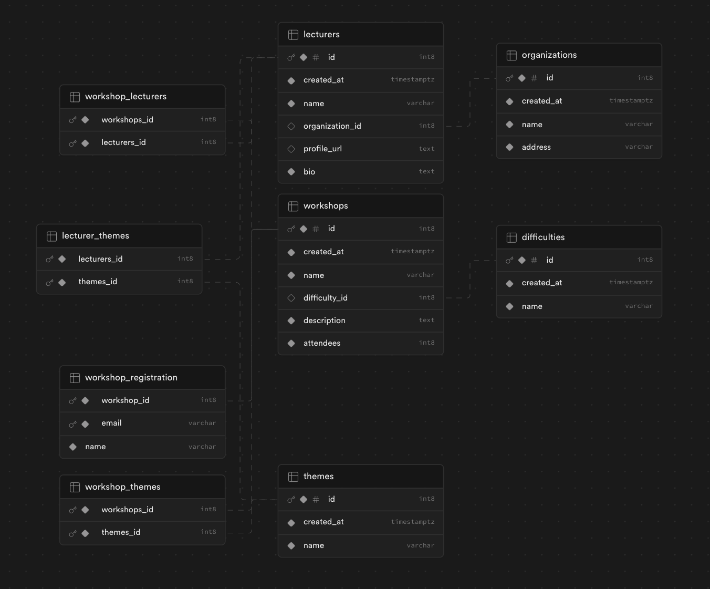

## Code School


Code School is a full-stack application designed to help students find and apply to lectures and workshops offered by various lecturers. Whether you're looking to enhance your skills in programming, cybersecurity, data science, or any other IT-related field, Code School provides a platform for discovering educational opportunities and connecting with knowledgeable instructors.

### Prerequisites

Before you begin, ensure you have the following software installed:

- [Node.js](https://nodejs.org/) (v20 or later)

## 📝 Usage

Follow these steps to set up the application locally:

1. Clone the repository:

   ```bash
   git clone https://github.com/Marko1310/Code_School
   ```

2. Install dependencies:

   ```bash
   npm install
   ```

3. Create .env files:
   Create a .env file with the required fields as mentioned in .env.example.

4. Generate and run database migrations

5. In the main folder, run the development server to start the app:
   ```bash
   npm run dev
   ```

# 👨‍💻 Tech stack

- **React (Frontend):**
  The frontend is built using React, a popular JavaScript library for building user interfaces. React enables the creation of dynamic and responsive user interfaces for an enhanced user experience.

- **Supabase (Backend and Database):**
  Code School leverages Supabase, an open-source alternative to Firebase, for its backend and database needs. Supabase offers real-time database updates and authentication features, all powered by PostgreSQL.

  

- **Forms with React Hook Form(Database):**
  React Hook Form is used for efficient form management in the frontend. With its lightweight and intuitive API, React Hook Form simplifies form development, enabling rapid development of interactive user interfaces.

- **Validation with Zod**
  Zod is employed for data validation. It ensures that input data adheres to the specified schema, enhancing the overall robustness and reliability of the application.

- **React Query**
  React Query is utilized to manage state and handle data fetching seamlessly. It provides a powerful set of tools for managing and caching API data in a React application.

- **Tailwind**
  Tailwind CSS is used for styling the frontend components. It provides a utility-first approach to styling, making it easy to create responsive and visually appealing user interfaces.

- **Material-UI (MUI)**
  Material-UI is integrated to enhance the UI with pre-built React components following the Material Design principles. It provides a consistent and visually pleasing user experience.

## 🚀 Features

- **Apply to Workshops:**
  Code School allows users to easily apply for workshops, enabling seamless registration and participation in educational events.

- **Filtering Workshops and Lecturers:**
  Users can conveniently filter workshops and lecturers based on themes, topics, or organizations, facilitating efficient discovery of relevant educational content.

- **Admin Features:**
  As an admin, you have full control over workshops, lectures, and organizations. You can view, add, edit, and delete workshops, lectures, and organizations, empowering you to manage and curate the platform's educational offerings.

## ✍️ Contributing

Contributions are welcome! Feel free to open issues or submit pull requests to improve the application.
